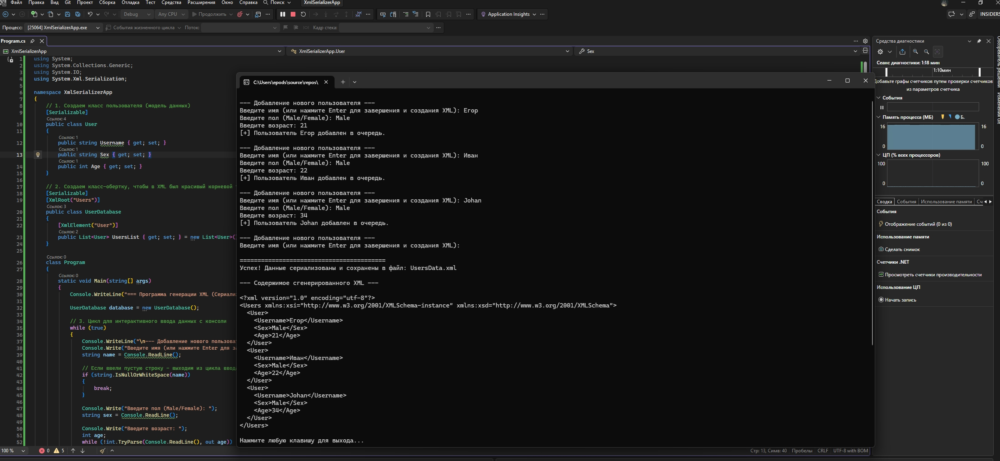

# CSharp-XmlSerializer: Интерактивная генерация XML

Консольное приложение на **C#**, демонстрирующее процесс объектно-ориентированного программирования и сериализации объектов в формат XML. 

##  Демонстрация работы

##  Суть проекта
Часто в интеграционных задачах требуется не только парсить входящие XML (например, через XSLT), но и динамически формировать XML-документы на основе данных, введенных пользователем или полученных из базы данных (учетной системы). Этот проект показывает, как собирать данные в объекты и корректно выгружать их в стандартизированный XML-файл.

##  Технологии
*   **C# / .NET**
*   **Класс `XmlSerializer`** (`System.Xml.Serialization`) — для автоматического преобразования свойств C#-объектов в XML-теги.
*   **Работа с потоками `FileStream`** — для безопасной записи сгенерированного документа на диск.

##  Особенности реализации
1. Интерактивный консольный интерфейс с валидацией ввода (защита от ввода текста вместо цифр возраста).
2. Использование классов-моделей (`User` и `UserDatabase`) с применением атрибутов `[Serializable]`, `[XmlRoot]` и `[XmlElement]` для жесткого контроля над структурой итогового XML-файла.
3. Автоматическое сохранение результата в файл `UsersData.xml` в рабочей директории программы.
